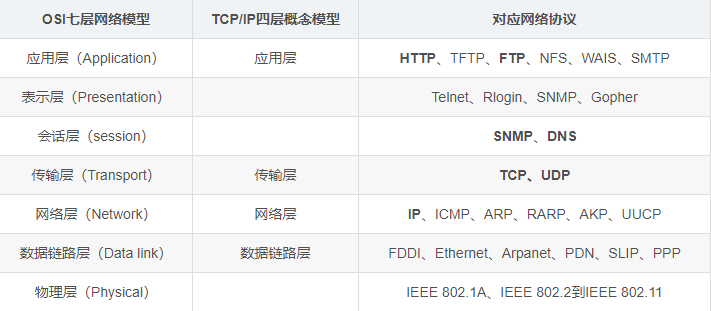
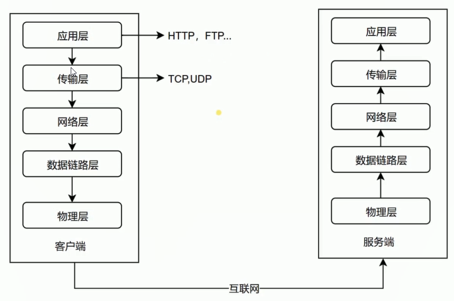
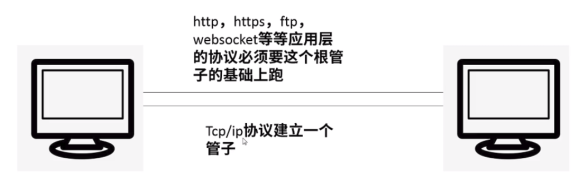
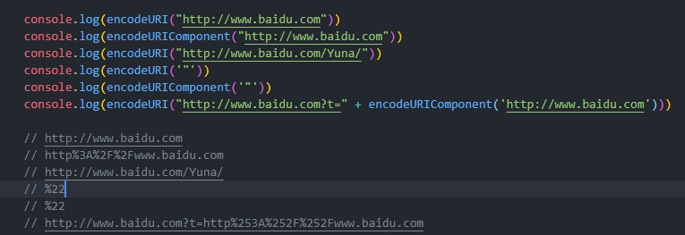

# 浏览器

## 浏览器渲染页面的过程
1. 构建对象模型（DOM,CSSOM）
构建过程：
* 读取html文档/读取css文档
* 将字节转换成字符
* 确定tokens（标签）
* 将tokens转换成节点
* 以节点构建 DOM 树/CSSDOM 树
>若在构建DOM树的过程中，当 HTML 解析器遇到一个 script
标记时，即遇到了js，将立即阻塞DOM树的构建。JS会对DOM节点进行操作，浏览器无法预测未来的DOM节点的具体内容，为了防止无效操作，节省资源，只能阻塞DOM树的构建。
::: warning 注意
若在HTML头部加载JS文件，由于JS阻塞，会推迟页面的首绘。为了加快页面渲染，一般将JS文件放到HTML底部进行加载，或是对JS文件执行async或defer加载。
:::
2. 构建渲染树（RenderTree）：将 DOM 和 CSSOM 整合。
3. 布局
4. 渲染

## 浏览器加载一个资源的过程
* 浏览器根据 DNS 服务器得到域名的 IP 地址
* 向这个 IP 的机器发送 http 请求
* 服务器收到、处理并返回 http 请求
* 浏览器得到返回内容

## cookie和WebStorage
### cookie
Cookie是服务器发给客户端的特殊信息，cookie是以文本的方式保存在客户端，每次请求时都带上它，如果没有设置过期时间关闭浏览器的同时cookie生命周期结束。
1. 判断用户是否登陆过网站，以便下次登录时能够实现自动登录（或者记住密码）。如果我们删除cookie，则每次登录必须从新填写登录的相关信息。
2. 保存上次登录的时间等信息。
3. 保存上次查看的页面。
4. 浏览计数。

缺点：
1. 大小受限
2. 用户可以操作（禁用）cookie，使功能受限。
3. 安全性较低。
4. 有些状态不可能保存在客户端。
5. 每次访问都要传送cookie给服务器，浪费带宽。
6. cookie数据有路径（path）的概念，可以限制cookie只属于某个路径下。
### session
当服务器收到请求需要创建session对象时，首先会检查客户端请求中是否包含sessionid。如果有sessionid，服务器将根据该id返回对应session对象。如果客户端请求中没有sessionid，服务器会创建新的session对象，并把sessionid在本次响应中返回给客户端。
1. 网上商城中的购物车
2. 保存用户登录信息
3. 将某些数据放入session中，供同一用户的不同页面使用
4. 防止用户非法登录

缺点：
1. Session保存的东西越多，就越占用服务器内存，对于用户在线人数较多的网站，服务器的内存压力会比较大。
2. 依赖于cookie（sessionID保存在cookie），如果禁用cookie，则要使用URL重写，不安全
3. 创建Session变量有很大的随意性，可随时调用，不需要开发者做精确地处理，所以，过度使用session变量将会导致代码不可读而且不好维护。

### cookie和session的区别
* cookie保存在浏览器端，session保存在服务器端
* 存储内容：cookie只能保存字符串类型，以文本的方式；session能支持任何类型的对象
* 单个cookie保存的数据不能超过4kb；session大小没有限制
* 安全性：session的安全性大于cookie
* sessionID存储在cookie中，若要攻破session首先要攻破cookie；
* sessionID是要有人登录，或者启动session_start才会有，所以攻破cookie也不一定能得到sessionID；
* 第二次启动session_start后，前一次的sessionID就是失效了，session过期后，sessionID也随之失效
* sessionID是加密的;
* 综上所述，攻击者必须在短时间内攻破加密的sessionID，这很难。

### sessionStorage和localStorage区别
* localStorage生命周期是永久，sessionStorage生命周期为当前窗口或标签页
* 相同浏览器的不同页面间可以共享相同的 localStorage（页面属于相同域名和端口）

### cookie和WebStorage的区别
* WebStorage大小一般5M或更大
* WebStorage保存在客户端，不会传送到服务器，节省网络流量
* cookie由对服务器的请求来传递，每次都会携带在HTTP头中，而WebStorage只在请求时使用数据，不参与和服务器的通信
* WebStorag速度更快
* webStorage更安全
* WebStorage不会随着HTTP header发送到服务器端，所以安全性相对于cookie来说比较高一些，不会担心截获，但是仍然存在伪造问题


## XSS攻击原理及其解决办法
原理：WEB应用程序混淆了用户提交的数据和JS脚本的代码边界,导致浏览器把用户的输入当成了JS代码来执行。

解决办法：
1. 过滤输入：在输入方面对所有用户提交内容进行可靠的输入验证，提交内容包括URL、查询关键字、http头、post数据等。
* 输入验证
2. 转义输出：对用户输入的内容进行HTML转义，转义后可以确保用户输入的内容在浏览器中作为文本显示，而不是作为代码解析。
* 输入内容作为文本解析


## 性能优化
性能优化原则：
* 多使用内存、缓存
* 减少cpu计算，减少网络请求，减少对硬盘的读写（非前端）

### 加载资源优化
* 静态资源的压缩合并
* 静态资源缓存
* CDN
* SSR后端渲染


## url详解
<b>Uniform Resource Locator,统一资源定位器，就是指网络地址</b>


### url的组成
`protocol :// host[:port] / path / [:parameters][?query]#fragment`

1. <b>protocol(协议)：</b>该URL的协议部分为“http：”，这代表网页使用的是HTTP协议。在Internet中可以使用多种协议，如HTTP，FTP等等本例中使用的是HTTP协议。在"HTTP"后面的“//”为分隔符
2. <b>host(域名)：</b>该URL的域名部分为“www.aspxfans.com”。一个URL中，也可以使用IP地址作为域名使用
   * IP地址：IP地址是用来唯一标识互联网上计算机的逻辑地址，让电脑之间可以相互通信，每台连网计算机都依靠IP地址来互相区分，相互联系。（坐标）
   * 域名：由于IP地址是数字标识，使用时难以记忆和书写，因此在IP地址的基础上又发展出一种符号化的地址方案，来代替数字型的IP地址。每一个符号化的地址都与特定的IP地址对应，这样网络上的资源访问起来就容易得多了。这个与网络上的数字型IP地址相对应的字符型地址，就被称为域名。（地名）
3. <b>port(端口)：</b>跟在域名后面的是端口，域名和端口之间使用“:”作为分隔符。端口不是一个URL必须的部分，如果省略端口部分，将采用默认端口
4. <b>path(路径)</b>后的最后一个“/”开始到“#”为止，是文件部分，如果没有“？”和“#”，那么从域名后的最后一个“/”开始到结束，都是文件名部分。本例中的文件名是“index.asp”。文件名部分也不是一个URL必须的部分，如果省略该部分，则使用默认的文件名
   1. 虚拟目录：从域名后的第一个“/”开始到最后一个“/”为止，是虚拟目录部分。虚拟目录也不是一个URL必须的部分。本例中的虚拟目录是“/news/”
   2. 文件名：从域名后的最后一个“/”开始到“？”为止，是文件名部分，如果没有“?”,则是从域名
5. <b>parameters（参数）</b> 使用动态路由时使用
6. <b>query-string(查询)：</b>从“？”开始到“#”为止之间的部分为参数部分，又称搜索部分、查询部分。本例中的参数部分为“boardID=5&ID=24618&page=1”。参数可以允许有多个参数，参数与参数之间用“&”作为分隔符。
7. <b>anchor(锚点)：</b>从“#”开始到最后，都是锚部分。本例中的锚部分是“name”。锚部分也不是一个URL必须的部分

### 协议
两个实体要想通信，必须有“同一种语言”，而且，对于通信内容，怎样通信和何时通信，都必须遵守一定的规定，这些规定就是协议。

<b>TCP/IP模型</b>






* <b>物理层</b> 定义物理设备之前如何传递数据（物理硬件（网卡，电脑设备，网线，光缆）将数据传输到互联网）
* <b>数据链路层</b> 提供链路管理错误检测、对不同通信媒介有关信息细节问题进行有效处理等
* <b>网络层</b> 为数据在结点之前传输创建逻辑链路，主要负责网络中数据包的传送等，为主机之间提供逻辑通信
* <b>传输层</b> （tcp/ip协议，udp协议）：是使用者使用平台和计算机信息网内部数据结合的通道，可以实现数据传输与数据共享，为应用进程之间提供逻辑通信
* <b>应用层</b> （HTTP协议）： 用来接收来自传输层的数据或者按不同应用要求与方式将数据传输至传输层

::: tip 提示
重点了解应用层中的HTTP、FTP，以及传输层当中的TCP和网络层中的ip部分
:::

#### http、websocket等协议与tcp、ip协议的关系



<b>IP</b>是网络之间互连的协议,位于TCP/IP模型的网络层，对上可载送传输层各种协议的信息，例如TCP、UDP等；对下可将IP信息包放到链路层，通过以太网、令牌环网络等各种技术来传送。IP协议也可以叫做因特网协议。
<b>TCP/IP</b>是传输控制协议/网际协议，是互联网相关的各类协议的统称，主要解决数据如何在网络中传输。
<b>HTTP</b>是应用层协议，主要解决如何包装数据。

::: tip 提示
HTTP只有请求和响应的概念，即需要走tcp协议的数据包
:::

<b>Socket</b>是对TCP/IP协议的封装，Socket本身并不是协议，而是一个调用接口（API），通过Socket，我们才能使用TCP/IP协议。
<i>可以把ip层想象成公路，tcp、udp是火车，而http，https等是货物</i>

<b>http连接</b>：http连接就是所谓的短连接，即客户端向服务端发送一次请求，服务器端响应后连接即会断掉；  
<b>socket连接</b>：socket连接就是所谓的长连接，理论上客户端和服务器端一旦建立起来连接将不会主动断掉；但是由于各种环境因素可能会连接断开。比如：服务器或客户端主机down了，网络故障，或者两者之间长时间没有数据传输，网络防火墙可能会断开该连接以释放网络资源。所以当一个socket连接中没有数据的传输，那么为了维持连接需要发送心跳消息,具体消息格式是开发者自己定义的。

<i>tcp数据包传到ip层之后，ip层就把tcp数据部分放到ip数据包的一段，然后协议栈根据ip协议从ip数据包里的数据信息找到下一个目的端口一般就是主机了</i>

#### 应用
* file 资源是本地计算机上的文件。格式`file:///`，注意后边应是三个斜杠。
* ftp <i>文件传输协议</i> 通过 FTP访问资源。格式 `FTP://`
* http <i>超文本传输协议</i> 通过 HTTP 访问该资源。 格式 `HTTP://`(最常用)
* https 通过安全的 HTTPS 访问该资源。 格式 `HTTPS://`
  
#### http和https的区别
http：是互联网上应用最广泛的一种网络协议，是一个客户端和服务器端请求和应答的标准（tcp），用于从www服务器传输超文本到本地浏览器的传输协议，它可以是浏览器更加高效，使网络传输减少。
https：是以安全为目标的http通道，简单讲是http的安全办。即http下加入ssl层，https的安全基础是ssl，因此加密的详细内容就需要ssl。

HTTPS的优点：
* 可认证用户和服务器，确保数据发送到正确的客户机和服务器；
* 加密传输可防止数据在传输过程中不被窃取、改变，确保数据的完整性
* 安全，大幅增加了中间人攻击的成本。
* 谷歌曾在2014年8月份调整搜索引擎算法，并称“比起同等HTTP网站，采用HTTPS加密的网站在搜索结果中的排名将会更高”。

HTTPS的缺点：
* 握手阶段比较费时，会使页面的加载时间延长近50%，增加10%到20%的耗电；
* HTTPS连接缓存不如HTTP高效，会增加数据开销和功耗，甚至已有的安全措施也会因此而受到影响；
* SSL证书需要钱，功能越强大的证书费用越高，个人网站、小网站没有必要一般不会用；
* SSL证书通常需要绑定IP，不能在同一IP上绑定多个域名，IPv4资源不可能支撑这个消耗；
* HTTPS协议的加密范围有限，在黑客攻击、拒绝服务攻击、服务器劫持等方面几乎起不到什么作用。最关键的，SSL证书的信用链体系并不安全，特别是在某些国家可以控制CA根证书的情况下，中间人攻击一样可行。


### 端口
在编程里，端口是一种“逻辑连接位置”，特别是在因特网协议TCP/IP中，客户端程序被分派计算机上特殊服务程序的一种方式。高层的使用TCP/IP协议如网页协议，超文本传输协议的应用软件，都有特别指定的端口。端口被分为固定端口和动态端口两大类：
*
固定端口（0～1023）：使用集中式管理机制，即服从一个管理机构对端口的指派，这个机构负责发布这些指派。由于这些端口紧绑于一些服务，所以我们会经常扫描这些端口来判断对方是否开启了这些服务，如TCP的21（ftp），80（http），139（netbios），UDP的7（echo），69（tftp）等等一些大家熟知的端口
* 动态端口（1024～49151）：这些端口并不被固定的捆绑于某一服务，操作系统将这些端口动态的分配给各个进程，同一进程两次分配有可能分配到不同的端口。


### 路径
一般用来表示主机上的一个目录或文件地址。


### 参数  
``` javascript
   {
     //只有获取到userId时才会显示该组件
     path: '/user/:userId',
     component: User
  }
  ```

### 查询
用于给动态网页（如使用CGI、ISAPI、PHP/JSP/ASP/ASP.NET等技术制作的网页）传递参数，可有多个参数，用“&”符号隔开，每个参数的名和值用“=”符号隔开。
一般来说，URL只能使用英文字母、阿拉伯数字和某些标点符号，不能使用其他文字和符号。中文字符或者特殊字符需要使用ASCII码编码之后再进行传递。

#### javascript常见的编码方式
* escape(string);
unescape(string);
escape用来对某个字符串进行编码的，不能直接用于url编码。
* encodeURI(string);
decodeURI(string);
不会对下列字符编码 ASCII字母 数字 ~ ! @ # $ & * ( ) = : / , ; ? + '(注：这是单引号，若果双引号"会被编码%22)进行编码。
输出utf-8形式，并且在每个字节前加上%。
* encodeURIComponent(string);
decodeURIComponent(string);
用于对URL的组成部分（如查询参数、路径等）进行个别编码，而不用于对整个URL进行编码。
不会对下列字符编码 ASCII字母 数字 ~ ! * ( ) '(注：这是单引号，若果双引号"会被编码%22)进行编码
和encodeURI一样，输出utf-8形式，并且在每个字节前加上%。




### 锚点
通过创建锚点链接，用户能够快速定位到目标内容。
制作锚标记：
1. 给元素定义命名锚记名
   语法：`<标记 id="命名锚记名"> </标记>`
2. 命名锚记连接
   语法：`<a href="#命名锚记名称"></a>`

### 其他锚点定位常见方法
* 使用name属性,只能针对a标签来定位，而对div等其他标签就不能起到定位作用。 
   ``` html
  <a href="#5F">锚点5</a>
  <a name="5F">1111111</href>
  ```
* 利用滚动原理，来将相应的元素滚动到可视区域内（js原生方法，jquery等框架使用不了）
  ``` html
  <li class="" onclick="javascript:document.getElementById('here').scrollIntoView()"></li>
  ```
* 界面互相定位跳转
   ``` html
  <a href="http://www.hsgjyl.com/#tube_baby">按钮位置</a>
  <div id="tube_baby"></div> <!-- 跳转的位置 -->
  ```