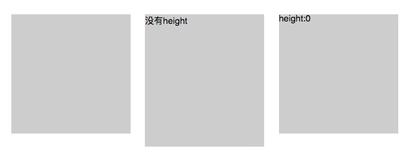
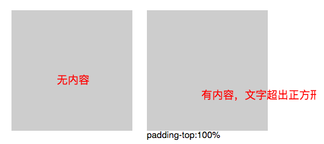

# CSS

## 响应式布局
一个网站能够兼容多个终端  
1.  百分比布局
2.  媒体查询
3.  rem响应式布局：rem单位无论嵌套层级如何，都只相对于浏览器的根元素（HTML元素）的`font-size`。`根元素`的font-size相当于提供了一个基准，当页面的size发生变化时，只需要改变font-size的值，那么以rem为固定单位的元素的大小也会发生响应的变化
4.  vw vh响应式布局
5.  弹性盒子
6.  设置viewport
   
## 伪类和伪元素的区别
*   伪类  :active/:focus/:hover/:link/:visited/:first-child/:lang
*   伪元素  ::after/::berore/::first-letter/::first-line  
伪元素的本质是`创建一个有内容的虚拟容器`，可以同时使用多个伪类，只能同时使用一个伪元素

## visiblity:hidden、opticay：0和display：none
visiblity:hidden占据原先页面空间,`元素的子元素可以设置visibility: visible 显示出来`。  
display:none 引起页面重绘和回流， visiblity:hidden 只引起页面重绘。

## CSS的引入方式
1. 内联（元素）
2. 内嵌（style）
3. 外链（link）
4. 导入（@import）  
   
外链和导入的`区别`：  
* link除了加载CSS外，还可以定义RSS等其他事务；@import只能加载CSS
* link引用CSS时，在页面载入时同时加载， @import需要页面完全载入后加载
* link无兼容问题，@import低版本的浏览器不支持
* link支持使用Javascript控制DOM去改变样式；而@import不支持
  
## 画一条0.5px的线
* meta viewport(移动端)
* 缩放`:after，transform：scaleY(0.5)` 
```css
.div:after {
    height: 1px;
    transform: scaleY(0.5);
    transform-origin: 50% 100%; // 要指定origin值, 要不然会模糊
    content: "";
    position: absolute;
    width: 100%;
    left: 0;
    bottom: 0;
    background: red;
}
```
0.5px边框：
``` css
.div:before {
    content: "";
    position: absolute;
    top: -50%;
    bottom: -50%;
    left: -50%;
    right: -50%;
    width: 200%;
    height: 200%;
    -webkit-transform: scale(0.5);
    transform: scale(0.5);
    border: solid 1px red;
    box-sizing:border-box;
}
```

## 过渡和动画
区别：
1. 动画不需要事件触发，过渡需要。
2. 过渡只有一组（两个：开始-结束） 关键帧，动画可以设置多个。  

过渡属性: transition-property: none | all | property;  
`property` : 定义应用过渡效果的 CSS 属性名称列表，列表以逗号分隔。
``` css
div {
    background:red;
    transition-property: background;
    transition-duration: 2s;
}
div:hover {
    background:salmon;
}
```  

## 用css画一个三角形/正方形
### 三角形
``` css
.triangle{
	width: 0px;
	height: 0px;
	border-bottom: 200px solid #cc7eb1;
    border-left: 200px solid transparent;
    border-right: 200px solid transparent;
}
``` 
### 正方形
``` html
<!-- 方法一：利用.CSS3 vw 单位，vw是相对于视口的宽度。1vw = 1% viewport width -->
<div class="square">hello,viewport</div>
<style>
.square {
        width: 50%;
        height: 50vw;
        background: #ccc;
  }
 </style>
```
``` html
<!-- 方法二：设置垂直方向的padding撑开容器(padding可以用百分比，百分比是根据它包含块的width来确定的，也就是父级元素的width） -->
<div class="square2"></div>
<style>
.square2{ 
    width: 50%;
    padding-bottom:100%; 
    height：0；
}
</style>
```
::: warning 注意
如果不写hegith的话，正方形内文字会溢出，溢出的高度正好就是文字所占空间的高度。
:::
  
:point_down:默认文字是从左到右，从上到下的排列,如果换成padding-top文字会在正方形外面。   

>如果一定要使用padding-top，可以在正方形里嵌套绝对定位的内容盒子，消除空间占用

<br>

``` html
<!-- 方法三：利用伪元素 -->
<div class="square4">
    <!-- 利用绝对定位 否则内容会撑开盒子-->
    <div class="con">伪元素</div>
</div> 
<style>
  .square4 {
      width: 100%; 
      background: #ccc;
  }
  .square4:after {
      content: '';
      display: block;
      padding-top: 100%;  
  } 
  .con{
      width: 100%;
      height: 100%;
      position: absolute; 
  }
</style>  
```
#### 让图片正方形且自适应
``` html
<!-- 方法一：通过style:background的方式写在标签内部 -->
<div class="square1" style="background: url(images/square.jpg)no-repeat center /cover"></div> 
<style>
.square1{
   width: 50%;
   padding-top:100%;/*padding-bottom:100%也可以*/
   height: 0;  /*可不写*/
}
</style>
```

``` html
<!-- 方法二：用img的形式 -->
<div class="square2">
    <div class="con">
        
    </div>
</div>
<style>
.squareimg{
    width: 100%;
    height: 100%;
    -o-object-fit: cover;
    object-fit: cover;
} 
.square2{
    padding-bottom:100%;
    height: 0;
    width: 50%;
    position: relative;
}
.square2 .con{
    position: absolute;
    width: 100%;
    height: 100%;
    top:0;
    left:0;
}
</style>
``` 
`object-fit: fill|contain|cover|scale-down|none|initial|inherit;`  
* fill:默认，不保证保持原有的比例，内容拉伸填充整个内容容器。  
* contain:保持原有尺寸比例。内容被缩放。  
* cover:保持原有尺寸比例。但部分内容可能被剪切。
* none:保留原有元素内容的长度和宽度，也就是说内容不会被重置。  
* scale-down:保持原有尺寸比例。内容的尺寸与 none 或 contain 中的一个相同，取决于它们两个之间谁得到的对象尺寸会更小一些。  
* initial:设置为默认值。  
* inherit:从该元素的父元素继承属性。 