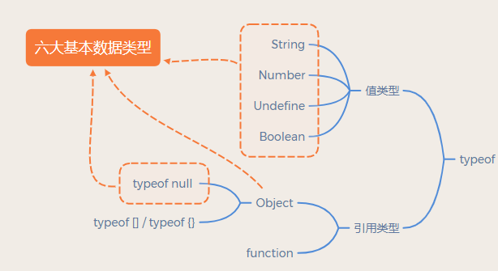
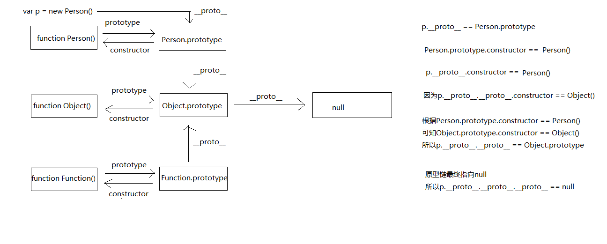
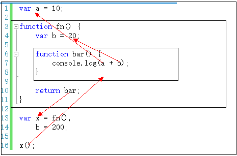
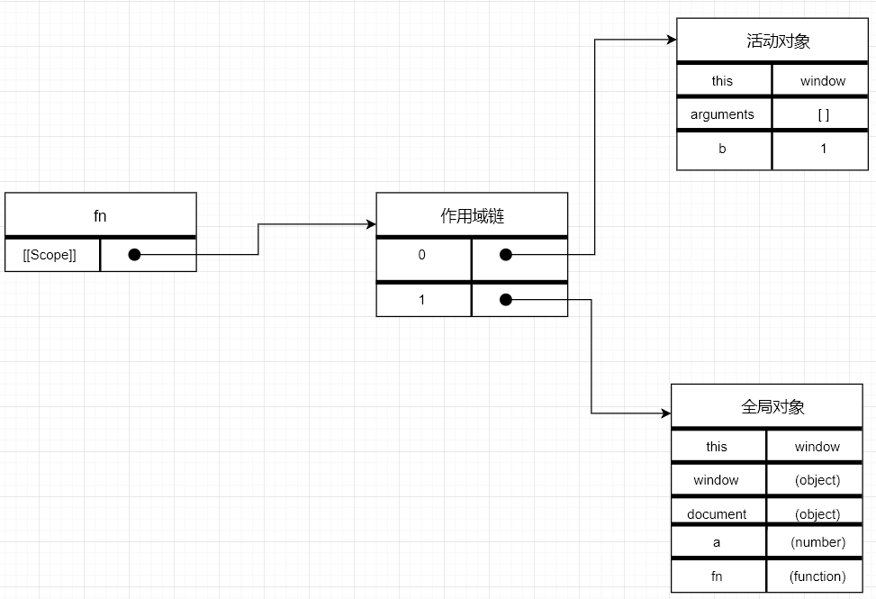

# JS/JQ

## 基本数据类型


## 强制类型转换
1. 字符串拼接
   ``` javascript
   '2' + true  //2true
   ```
2. ==运算（慎用） `除了 == null 其他都用 ===`
3. 逻辑运算
   ``` javascript
   console.log(10 && 0)  // 0  10为true
   console.log(' ' || 'abc')  // 'abc '   ' '为false
   ```
4. if语句
   ```javascript
   var a = 0
   var b = 100   if (b) {}  // true
   var c = ''   if (c) {}  // false
   
   console.log(!!a)  // 判断一个变量是true/false
   ```

## 原型和原型链（显式原型/隐式原型）
* 所有引用类型（函数，数组，对象）都拥有__proto__属性（隐式原型）
* 所有函数拥有prototype属性（显式原型）（仅限函数）
* 原型对象：拥有prototype属性的对象，在定义函数时就被创建
  
<b>实例w的隐式原型指向它构造函数的显式原型，指向的意思是恒等于</b>

``` javascript
w.__proto__ === Word.prototype
```
构造函数的原型链：`tsrot ==》 Person.prototype ==》 Object.prototype ==》 null`  



## 判断是否为空对象方法
* 将json对象转化为json字符串，再判断该字符串是否为"{}"
    ``` javascript
    var data = {};
    var b = (JSON.stringify(data) == "{}");
    alert(b);//true
    ```
* for in循环判断
    ``` javascript
    var obj = {};

    var b = function() {
        for(var key in obj) {
            return false;
        }
        return true;
    }
    
    alert(b());//true

    ```
* jquery的isEmptyObject方法(将方法二封装)
    ``` javascript
    var data = {};
    var b = $.isEmptyObject(data);
    alert(b);//true
    ```
* Object对象的getOwnPropertyNames方法，返回值是对象中属性名组成的数组，通过判断数组的length来判断此对象是否为空（此方法不兼容ie8，其余浏览器没有测试）
    ``` javascript
    var data = {};
    var arr = Object.getOwnPropertyNames(data);
    alert(arr.length == 0);//true
    ```
* ES6的Object.keys()方法，原理同方法四
    ``` javascript
    var data = {};
    var arr = Object.keys(data);
    alert(arr.length == 0);//true
    ```

## 闭包
概念:`指有权访问另一个函数作用域中的变量的函数，一般情况就是在一个函数中包含另一个函数`。

作用：访问函数内部变量、保持函数在环境中一直存在，不会被垃圾回收机制处理。

<b>如果里函数引用（or访问）了外函数的某个变量，那这个变量就能享受和全局变量一样的特权。</b>

### 使用场景
1. setTimeout
   原生的setTimeout传递的第一个函数不能带参数，通过闭包可以实现传参效果。
   ``` javascript
   function f1(a) {
       function f2() {
           console.log(a);
        }
        return f2;
    }
    var fun = f1(1);
    setTimeout(fun,1000);//一秒之后打印出1
   ```
2. 回调
   ``` javascript
   function changeSize(size){
       return function(){
           document.body.style.fontSize = size + 'px';
        };
    }
    var size12 = changeSize(12);
    var size14 = changeSize(20);
    var size16 = changeSize(30);

    document.getElementById('size-12').onclick = size12;
    document.getElementById('size-20').onclick = size14;
    document.getElementById('size-30').onclick = size16;
    ```
3. 函数防抖  
   在事件被触发n秒后再执行回调，如果在这n秒内又被触发，则重新计时。
   ``` javascript
   function debounce(fn,delay){
       let timer = null
       //借助闭包
       return function() {
           if(timer){
               clearTimeout(timer) //进入该分支语句，说明当前正在一个计时过程中，并且又触发了相同事件。所以要取消当前的计时，重新开始计时
               timer = setTimeOut(fn,delay)
            }else{
                timer = setTimeOut(fn,delay) // 进入该分支说明当前并没有在计时，那么就开始一个计时
            }
        }
    }
    ```
4. 封装私有变量

### 优点和缺点  
闭包的优点：
* 方便调用上下文中声明的局部变量。
* 可以在一个函数中再创建个函数，避免了传参的问题  。

闭包的缺点：
* 使用闭包可以使函数在执行完后不被销毁，保留在内存。
中，如果大量使用闭包就会造成`内存泄露，内存消耗很大`。

## 深拷贝和浅拷贝
浅拷贝的实现方法：
1. 简单的引用复制
2. Object.assign()
    ``` javascript
    var x = {
        a: 1,
        b: { f: { g: 1 } },
        c: [ 1, 2, 3 ]
    };
    var y = Object.assign({}, x);
    console.log(y.b.f === x.b.f);     // true
    ```
3. Array的slice和concat方法(`看起来像是深拷贝。而实际上它是浅拷贝`)  

深拷贝的实现方法：
1. JSON对象的parse和stringify
parse方法:将JSON字符串反序列化成JS对象；
stringify方法：将JS对象序列化成JSON字符。

    ``` javascript
        //例1
        var source = { name:"source", child:{ name:"child" } } 
        var target = JSON.parse(JSON.stringify(source));
        target.name = "target";  //改变target的name属性
        console.log(source.name); //source 
        console.log(target.name); //target
        target.child.name = "target child"; //改变target的child 
        console.log(source.child.name); //child 
        console.log(target.child.name); //target child
        //例2
        var source = { name:function(){console.log(1);}, child:{ name:"child" } } 
        var target = JSON.parse(JSON.stringify(source));
        console.log(target.name); //undefined
        //例3
        var source = { name:function(){console.log(1);}, child:new RegExp("e") }
        var target = JSON.parse(JSON.stringify(source));
        console.log(target.name); //undefined
        console.log(target.child); //Object {}
    ```
2. jQuery.extend()
3. 手写递归
    ``` javascript
    function deepClone1(obj) { //判断拷贝的要进行深拷贝的是数组还是对象，是数组的话进行数组拷贝，对象的话进行对象拷贝
        var objClone = Array.isArray(obj) ? [] : {}; //进行深拷贝的不能为空，并且是对象或者是数组
        if (obj && typeof obj === "object") {
            for (key in obj) {
                if (obj.hasOwnProperty(key)) {
                    if (obj[key] && typeof obj[key] === "object") {
                        objClone[key] = deepClone1(obj[key]);
                    } else {
                        objClone[key] = obj[key];
                    }
                }
            }
        }
        return objClone;
    }
    ``` 
<b>区别：浅拷贝只复制指针，深拷贝会另外创造一个一模一样的对象。</b>


## 宏任务和微任务
|  | 宏任务（macrotask） | 微任务（microtask） |
| :----: | :----: | :----: |
| 谁发起的 | 宿主（Node、浏览器） | JS引擎 |
| 具体事件 | script/setTimeout/setInterval/<br>UI rendering/UI事件/<br>postMessage，MessageChannel/<br>setImmediate，I/O（Node.js）| Promise/MutaionObserver/<br>process.nextTick（Node.js）| 
| 谁先运行 | 后运行 | 先运行 |
| 会触发新一轮Tick吗 | 会 | 不会 |  
<br>  

  

<b>区别：宏任务中的事件放在callback queue中，由事件触发线程维护；微任务的事件放在微任务队列中，由js引擎线程维护。</b>

## 事件代理
概念：把原本需要绑定在子元素的响应事件（click、keydown......）委托给父元素，让父元素担当事件监听的职务。  
原理：DOM元素的事件冒泡。  
优点：减少事件注册，减少内存占用；可以动态绑定事件。  

实现方法：
1. `switch case`
2. `$(selector).delegate(childSelector, event, data, function)`

## 防抖和节流
<b>防抖</b>：触发高频事件后n秒内函数只会执行一次，如果n秒内高频事件再次被触发，则重新计算时间。

``` javascript
//每次触发事件时设置一个延迟调用方法，并且取消之前的延时调用方法
function debounce(fn) {
    let timeout = null; // 创建一个标记用来存放定时器的返回值
    return function () {
        if(timeout){
            clearTimeout(timeout) 
        }
        // 然后又创建一个新的 setTimeout, 这样就能保证interval 间隔内如果时间持续触发，就不会执行 fn 函数
        timeout = setTimeout(() => {
            fn.apply(this, arguments);
        }, 500);
    };
}
``` 
<b>节流</b>：高频事件触发，但在n秒内只会执行一次，所以节流会稀释函数的执行频率。

``` javascript
//每次触发事件时，如果当前有等待执行的延时函数，则直接return
function throttle(fn) {
    let canRun = true; // 通过闭包保存一个标记
    return function () {
         // 在函数开头判断标记是否为true，不为true则return
        if (!canRun) return;
         // 立即设置为false
        canRun = false;
        // 将外部传入的函数的执行放在setTimeout中
        setTimeout(() => { 
        // 最后在setTimeout执行完毕后再把标记设置为true(关键)表示可以执行下一次循环了。
        // 当定时器没有执行的时候标记永远是false，在开头被return掉
            fn.apply(this, arguments);
            canRun = true;
        }, 500);
    };
}
```
<b>区别：防抖动是将多次执行变为最后一次执行，节流是将多次执行变成每隔一段时间执行</b>

## setTimeout()与setInterval()
### setTimeout()超时调用
接受两个参数：要执行的代码和以毫秒表示的时间（代码执行前的等待时间）。其中，第一个参数可以是一个字符串（和eval()中使用的字符串一样），也可以是一个函数。第二个参数是一个表示等待多长时间的毫秒数。  
``` js
setTimeout("alert('hello')",2000)  //不推荐使用字符串

setTimeout(function(){
    alert('world');
},2000);
```
调用setTimeout()之后，该方法会返回一个数值ID，表示超时调用。这个超时调用ID是计划执行代码的唯一标识符，可以通过它来取消超时调用。取消超时调用使用方法clearTimeout();  
``` js
var timeId = setTimeout(function(){
    alert('world');
},2000);

clearTimeout(timeId);
```

### setInterval()间歇调用
按照指定的时间间隔重复执行代码，直至间歇调用被取消或页面被卸载。
``` js
var num = 0,max = 10,intervalId = null;

function incrementNumber(){
    num ++;
    if(num == max){
        clearInterval(intervalId)
        alert("Done");
    }
}
intervalId = setInterval(incrementNumber,500);
```
但是通常情况下，很少真正使用间歇调用，因为后一个间歇调用可能在前一个间歇调用结束之前调用。因此，我们通常会使用超时调用来模拟间歇调用。
``` js
var num = 0,max = 10;

function incrementNumber(){
    num ++;
    if(num < max){
        setTimeout(incrementNumber,500);
        console.log(num)
    }
    else{
        alert("Done");
    }
}
setTimeout(incrementNumber,500);
```

### 执行队列问题
setTimeout并不一定是在到了指定时间的时候就把事件推到任务队列中，只有当在任务队列中的上一个setTimeout事件被主线程执行后，才会继续再次在到了指定时间的时候把事件推到任务队列，那么setTimeout的事件执行肯定比指定的时间要久，具体相差多少跟代码执行时间有关  
setInterval则是每次都精确的隔一段时间就向任务队列推入一个事件，无论上一个setInterval事件是否已经执行，所以有可能存在setInterval的事件任务累积，导致setInterval的代码重复连续执行多次，影响页面性能。  

### this的指向问题  
由setTimeout()调用的代码运行在与所在函数完全分离的执行环境上。这会导致，这些代码中包含的 this 关键字在非严格模式会指向 window (或全局)对象  

### setTimeout间隔设置为0的意义  
`setTimeout(fn,0)`的含义是，指定某个任务在主线程最早可得的空闲时间执行，也就是说，尽可能早得执行。它在"任务队列"的尾部添加一个事件，因此要等到同步任务和"任务队列"现有的事件都处理完，才会得到执行。
>同步代码转异步代码，为了手动调配优先级不高的代码靠后执行。

### 最小延时和最大延时  
最小：在浏览器中，setTimeout()/setInterval() 的每调用一次定时器的最小间隔是4ms  
最大：包括 IE, Chrome, Safari, Firefox 在内的浏览器其内部以32位带符号整数存储延时。这就会导致如果一个延时(delay)大于 2147483647 毫秒 (大约24.8 天)时就会溢出，导致定时器将会被立即执行。


## 异步
### 前端什么时候需要使用异步？
* 定时任务：`setTimeout`,`setInverval`
* 网络请求：ajax请求，动态``加载
* 事件绑定  

### 同步和异步的区别
* 同步会阻塞代码执行，异步不会
* `alert`是同步，`setTimeout`是异步


## JS作用域  
（js没有块级作用域）  
``` js
var a = 0;

if(true){
    var a = 1;
    console.log(a);  //1
}

console.log(a);  //1
```  

JavaScript 变量生命周期在它声明时初始化,局部变量在函数执行完毕后销毁,全局变量在页面关闭后销毁。  
作用域最大的用处就是隔离变量，不同作用域下同名变量不会有冲突。  

<b>变量取值：到创建 这个变量 的函数的作用域中取值</b>


### 全局作用域  
代码在程序的任何地方都能被访问，不使用var定义的变量拥有全局作用域，window 对象的内置属性都拥有全局作用域，没有声明在任何函数内部的函数拥有全局作用域。  

### 局部作用域  
只能在函数内部访问，使用var在函数内部定义的变量，和使用function在函数内部声明的函数，拥有局部作用域。  
``` js 
function fn () {
  var c = 2;
}

console.log(c); // 报错，c变量未定义 
```  
``` js
function t(flag){
    if(flag) {
        s = "ifscope";
        for (var i = 0; i < 2; i++){

        }
    }
    console.log(i); //2
}

t(true);
console.log(s);  //ifscope
console.log(window.s);  //ifscope
```
Js中没有用var声明的变量都是全局变量，而且是顶层对象的属性。

### 作用域链  
一般情况下，变量取值到 创建 这个变量 的函数的作用域中取值。但是如果在当前作用域中没有查到值，就会向上级作用域去查，直到查到全局作用域，这么一个查找过程形成的链条就叫做作用域链。 
``` js
var x = 10;

function fn(){
    console.log(x);  //10
}

function show(f){
    var x = 20;
    (function(){
       f();    // 10
    })()  
}

show(fn);
```
  

Function对象有一个仅供 JavaScript 引擎存取的内部属性。  
这个属性就是[[Scope]]。[[Scope]]包含了一个函数被创建的作用域中对象的集合。这个集合被称为函数的作用域链，它决定了哪些数据能被函数访问。  
关于作用域链，局部作用域可以访问到全局作用域中的变量和方法，而全局作用域不能访问局部作用域的变量和方法。  

``` js
var a = 0;

function fn () {
  var b = 1;
  console.log(a); // 输出 0
}

// 全局作用域并不能访问 fn 函数中定义的 b 变量
console.log(b); // 报错

fn();
```

当函数fn()执行时，会创建一个名为执行环境的独一无二的内部对象。函数每执行一次，都会创建一个执行环境。当函数执行完毕，执行环境就会被销毁。  
每个执行环境都有自己的作用域链，用来解析标识符。当执行环境被创建时，它的作用域就会初始化为当前运行函数的[[Scope]]属性中的对象。  
执行环境创建完成之后，就会生成一个`活动对象`，这个对象包含了当前函数的所有`局部变量`，`命名参数`，`参数集合`和`this`。此对象会被推入作用域链的最前端。  
当执行环境被销毁后，`活动对象`也会随之被销毁。  

当fn()时，会使用到a变量，这时候就会搜索执行环境的作用域链，找到就使用，找不到就会到作用域链的下一个对象找，如果搜寻到最后，还没找到，那就认定这个变量是未定义的。  

  


### this的绑定
this的绑定有以下几种可能：
1. 默认绑定，默认指向全局作用域
2. 隐式绑定，普通函数this指向函数调用的执行环境，箭头函数指向函数声明所处的执行环境  
3. 显式绑定，bind、call、apply
4. new绑定，this指向new出来的对象
