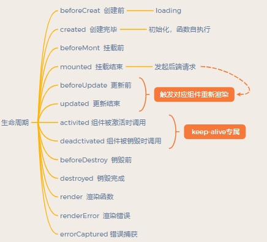
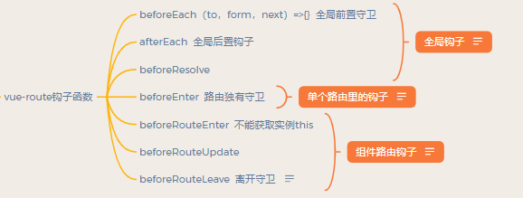

# vue

## vue的生命周期

扩展： 


## 路由
### vue-route钩子函数

* 无论访问哪一个路径都会触发全局钩子函数
* 单个路由里的钩子只有访问到该路由才触发
* 组件路由钩子是写在组件中访问路径，即将渲染组件时触发  
<br>
* next: Function: 一定要调用该方法来 resolve 这个钩子。执行效果依赖 next 方法的调用参数。
  * next(): 进行管道中的下一个钩子。如果全部钩子执行完了，则导航的状态就是 confirmed (确认的)。
  * next(false): 中断当前的导航。如果浏览器的 URL 改变了 (可能是用户手动或者浏览器后退按钮)，那么 URL 地址会重置到 from 路由对应的地址。
  * next('/') 或者 next({ path: '/' }): 跳转到一个不同的地址。当前的导航被中断，然后进行一个新的导航。你可以向 next 传递任意位置对象，且允许设置诸如 replace: true、name: 'home' 之类的选项以及任何用在 router-link 的 to prop 或 router.push 中的选项。
  * next(error): (2.4.0+) 如果传入 next 的参数是一个 Error 实例，则导航会被终止且该错误会被传递给 router.onError() 注册过的回调。
  <b>确保 next 函数在任何给定的导航守卫中都被严格调用一次。它可以出现多于一次，但是只能在所有的逻辑路径都不重叠的情况下，否则钩子永远都不会被解析或报错。</b>这里有一个在用户未能验证身份时重定向到 /login 的示例：

    ``` javascript
    // BAD
    router.beforeEach((to, from, next) => {
        if (to.name !== 'Login' && !isAuthenticated) next({ name: 'Login' })
        // 如果用户未能验证身份，则 `next` 会被调用两次
        next()
    })
    ```
    ``` javascript
    // GOOD
    router.beforeEach((to, from, next) => {
        if (to.name !== 'Login' && !isAuthenticated) next({ name: 'Login' })
        else next()
    })
    ```
* 离开守卫-通常用来禁止用户未保存更改时离开
### 动态路由
如果提供了 path，params 会被忽略，上述例子中的 query 并不属于这种情况。取而代之的是下面例子的做法，你需要提供路由的 name 或手写完整的带有参数的 path：

``` javascript
const userId = '123'
router.push({ name: 'user', params: { userId }}) // -> /user/123
router.push({ path: `/user/${userId}` }) // -> /user/123
// 这里的 params 不生效
router.push({ path: '/user', params: { userId }}) // -> /user
```
| 模式| 匹配路径 | $route.params |
| :----: | :----: | :----: |
| /user/:username | /user/evan | `{ username: 'evan' }` |
| /user/:username/post/:post_id | /user/evan/post/123 | `{ username:'evan', post_id: '123' }` |

### 嵌套路由

``` javascript
const router = new VueRouter({
  routes: [
    {
      path: '/user/:id',
      component: User,
      children: [
        {
          // 当 /user/:id/profile 匹配成功，
          // UserProfile 会被渲染在 User 的 <router-view> 中
          path: 'profile',
          component: UserProfile
        },
        {
          // 当 /user/:id/posts 匹配成功
          // UserPosts 会被渲染在 User 的 <router-view> 中
          path: 'posts',
          component: UserPosts
        }
      ]
    }
  ]
})
```
### 重定向

``` javascript
//从a重定向到b
const router = new VueRouter({
  routes: [
    { path: '/a', redirect: '/b' }
  ]
})

//重定向的路由也可以是一个命名的路由
const router = new VueRouter({
  routes: [
    { path: '/a', redirect: { name: 'foo' }}
  ]
})

//动态返回重定向目标
const router = new VueRouter({
  routes: [
    { path: '/a', redirect: to => {
      // 方法接收 目标路由 作为参数
      // return 重定向的 字符串路径/路径对象
    }}
  ]
})
```
### 路由的两种模式
vue-router 默认 hash 模式。
#### hash
当 URL 改变时，页面不会重新加载。  
#### history
如果后台没有正确的配置，当用户在浏览器直接访问 http://oursite.com/user/id 就会返回 404，这就不好看了。
所以呢，你要在服务端增加一个覆盖所有情况的候选资源：如果 URL 匹配不到任何静态资源，则应该返回同一个 index.html 页面，这个页面就是你 app 依赖的页面。  
路由的切换：
``` javascript
//包括 back,forward,go三个方法，对应浏览器的前进，后退，跳转操作
history.go(-2); //后退两次
history.go(2);//前进两次
history.back();//后退
history.forward();前进
```
路由的修改:

```javascript
//包括了pushState,replaceState两个方法,这两个方法接收三个参数:stateObj,title,url
history.pushState({color:'red'}, 'red', 'red'})
window.onpopstate = function(event){
    console.log(event.state)
    if(event.state && event.state.color === 'red'){
        document.body.style.color = 'red';
    }
}
history.back();
history.forward();
```
通过pushstate把页面的状态保存在state对象中，当页面的url再变回这个url时，可以通过event.state取到这个state对象，从而可以对页面状态进行还原，这里的页面状态就是页面字体颜色，其实滚动条的位置，阅读进度，组件的开关的这些页面状态都可以存储到state的里面。
## computed计算属性
计算函数，复杂的计算都应该放在这里，尽量不要直接在模板语法里面计算，在此处计算的值是会动态变的，即计算的数中有一个值变了，最终结果也会跟着变，类似于封装的计算函数,即`【计算属性是基于它们的响应式依赖进行缓存的,当其依赖的属性的值发生变化时，计算属性会重新计算，反之，则使用缓存中的属性值】`。

``` javascript
computed:{ 
    addNum:function(){ //addnum可以直接在模板语法里面用，相当于data内的值
        return Number(this.nums) + Number(this.num1) + Number(this.num2);
    }
},
```
### $watch侦听属性
`vm.$watch`监听数据变化

``` javascript
data:{
    a:1, 
    b:{ 
        c:1 
    }
}, 
watch:{
    a(val, oldVal){//普通的watch监听
        console.log("a: "+val, oldVal); 
    },
    b:{//深度监听，可监听到对象、数组的变化
        handler(val, oldVal){
            console.log("b.c: "+val.c, oldVal.c); 
        }, 
        deep:true // 深度监听 (属性变化)
    //配置项immediate，默认为false。设置之后在数据绑定时就会执行handler函数，而不是在数据改变后才执行
    } 
 }

//对于组件选项外定义的监听函数，需要手动调用unWatch（）函数进行注销

vm.$watch("a",function(val,oldVal){
 console.log(val)
```
### 和$watch侦听属性的区别
&emsp;&emsp;watch一般用于监控路由、input输入框的值特殊处理等等，它比较适合的场景是一对多（浏览器自适应、监控路由对象、监控自身属性变化），computed则是多对一和一对一（监听到数据变化从而进行某一个操作）（计算总价格、过滤某些数据）。
1. computed是计算值，只有值发生变化才会执行方法，watch是监听观察动作，有改变就执行
2. computed具有`缓存性`，数据变化时先读取缓存，值没变这不做操作，而watch没有缓存，直接执行
3. watch接收两个参数（新，旧）
4. watch可以在数据变化时做一些`异步处理`或开销大的操作

