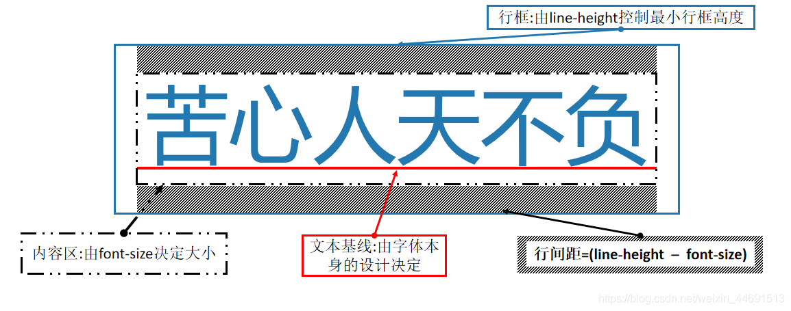
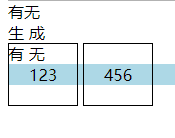
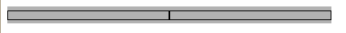

# CSS
## css行盒模型
常见的行盒模型：包含具体内容的元素 `span/strong/em/i/img/video/audio`  <br><br>

特点：  
1. 不能设置宽高  =>  使用字体大小、字体类型、行高调整行盒的宽高
   * 内容区：文字大小是由font-size决定的，文字大小常有两类：①px，②em例：1.5em、2em，含义为该文字的大小是父元素文字大小的1.5倍，2倍）
   * 文本基线：文本基线的位置由该字体中的X的小写字母的底线决定，但同时也可以更改， 基线baseline、中线middle、顶线top、下线bottom 在style中更改 `vertical-align: bottom`
   * 行间距：行间距指的是上下两行文字内容区之间的间距。行间距 =（行高 - 文字大小）/ 2  
2. 上下padding无效，上下margin无效【即不会撑开盒子】，垂直方向用padding和border会在视觉上出现效果margin不会【存在margin但是看不见】，但是不占据实际空间，当有2个内容时会相互覆盖  
<br>

### 行块盒
`display：inline-block` 的盒子  
1. 不独占一行
2. 盒模型中所有尺寸都有效【可以设置宽高】  

### 空白折叠
一个空格一个回车和多空格多个回车都会折叠成一个空格显示在页面上。
``` html
<section>        
	<span>有</span><span>无</span>    
</section>    
<section>        
	<span>生</span>           <span>成</span>    
</section>    
<section>        
	<span>有</span>        
	<span>无</span>    
</section>
<!-- 有无 -->
<!-- 生 成 -->
<!-- 有 无 -->
```

### 为什么两个宽度50%、inline-block的div层无法并行显示？
``` html
<div class="left"></div>
<div class="right"></div>
```
>解决方法：将两个div写在同一行，或者父元素设置font-size:0

### 浏览器中div嵌套出现空白问题  
``` html
<div class="wrapper">
    <div class="left"></div><div class="right"></div>
</div>
```
``` css
.wrapper{
    width: 400px;
    background-color: #b2b2b2;
    /* font-size: 0; */
}
.left,.right{
    display: inline-block;
    width: 50%;
    border: 1px solid black;
    box-sizing: border-box;
    height: 42px;
    /* vertical-align: top; */
}
```
  
>出现空白的原因是因为内部行盒是根据父级div文本基线来定位置，导致行盒的底部到外层div底部还会有空隙  
>>div嵌套img同理，使用vertical-align：bottom，因为img的默认样式是inline，不推荐用display:block改变其盒模型来达到效果

解决方法：  
* 在html去除所有空格和换行
* 父级元素设置`font-size：0`
* 子元素设置`vertical-align：top/bottom/middle`【只要不是`baseline`就行】
* 给元素设置负值margin
* 绝对定位脱离标准文档流  

<b>特殊情况</b>：当内部行盒高度设置小于浏览器默认font-size时，div内部上下都将出现空白，此时单独设置vertical-align不能完全消除空隙  
  
`vertical-align：bttom`  
  
`vertical-align：top`  
  
解决方法：父级元素设置`font-size：0`

::: warning 注意
父级元素设置了`font-size:0`之后子元素要重新设置font-size
:::