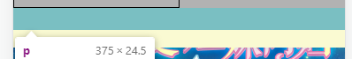

# Rem布局详解
## font-size：62.5%
浏览器的默认字体高度一般为16px，选择用rem控制字体时，先需要设置根节点html的字体大小，因为浏览器默认字体大小16px*62.5%=10px。这样1rem便是10px，方便了计算。
### 为什么一般是 html{font-size:62.5%;} 而不是 html{font-size:10px;}？
>因为有些浏览器默认的不是16px，或者用户修改了浏览器默认的字体大小（因浏览器分辨率大小，视力，习惯等因素）。如果我们将其设置为10px，一定会影响在这些浏览器上的效果，所以最好用绝大多数用户默认的16作为基数 * 62.5% 得到我们需要的10px。
``` css 
html {font-size: 62.5%;/*10 ÷ 16 × 100% = 62.5%*/}
body {font-size: 1.4rem;/*1.4 × 10px = 14px */}
h1 { font-size: 2.4rem;/*2.4 × 10px = 24px*/}
```
实际项目设置成 font-size: 62.5%可能会出现问题，因为chrome不支持小于12px的字体，计算小于12px的时候，会默认取12px去计算，导致chrome的em/rem计算不准确。  
针对这个现象，可以尝试设置html字体为100px，body 修正为16px，这样 0.1rem 就是 10px，而body的字体仍然是默认大小，不影响未设置大小的元素的默认字体的大小。  
::: danger 局限性
目前ie不支持 对pc页面来讲使用次数不多；  
数据量大：所有的图片，盒子都需要给一个准确的值；才能保证不同机型的适配。
:::

### 为什么设置了line-height之后的高度和height不一样    
   

  

line-height高度只能为整数，根据rem换算为px时会自动舍弃小数，这一特点也会造成使用rem布局时对于没有定height只有line-height的行盒在页面尺寸变化时导致页面存在较大误差。